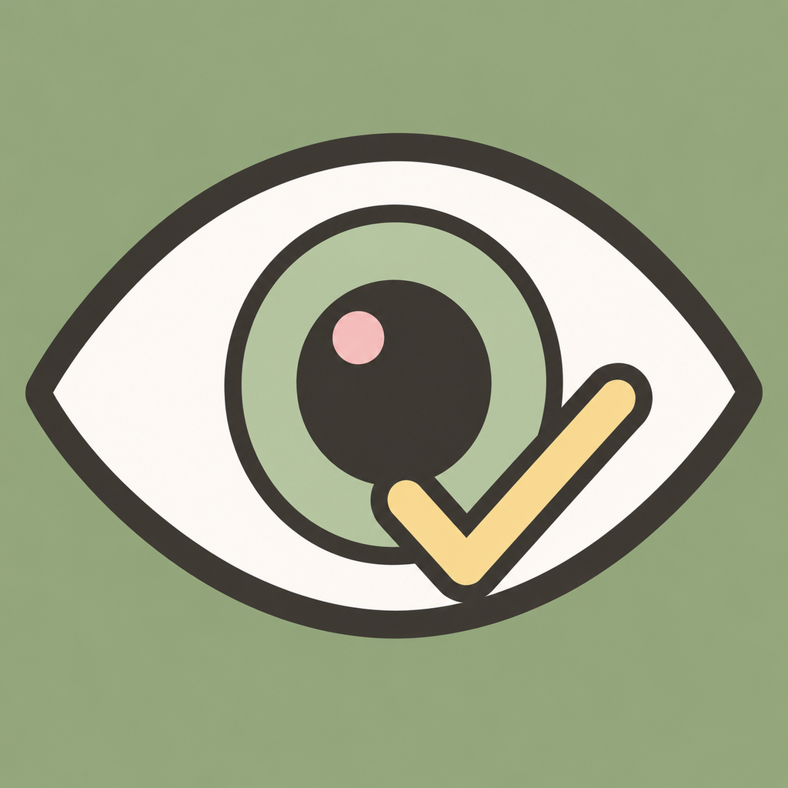

  

<h1 align="center">Sight Check: Eye Chart Game — Riesci a leggere le lettere più piccole? Il gioco della tabella ottotipica per iPhone</h1>

  <b>Un gioco casual e gratuito ispirato alle classiche tavole di lettere dell'oculista. Allontanati dallo schermo, leggi ad alta voce righe di lettere sempre più piccole, tieni traccia del punteggio e batti il tuo record personale. Sfida amici e famiglia. Gratis per sempre, senza pubblicità, senza account, completamente offline — i tuoi risultati non lasciano mai il tuo iPhone.</b>

  

  
  
  
  
  
  
  

  <b>Lingue:</b>
  <a href="README.md">English</a> ·
  <a href="README.es.md">Español</a> ·
  <a href="README.pt-BR.md">Português</a> ·
  <a href="README.de.md">Deutsch</a> ·
  <a href="README.fr.md">Français</a> ·
  <a href="README.nl.md">Nederlands</a> ·
  <a href="README.pl.md">Polski</a> ·
  <a href="README.cs.md">Čeština</a> ·
  <a href="README.uk.md">Українська</a> ·
  <a href="README.ru.md">Русский</a> ·
  <a href="README.tr.md">Türkçe</a> ·
  <a href="README.ar.md">العربية</a> ·
  <a href="README.hi.md">हिन्दी</a> ·
  <a href="README.zh-CN.md">中文</a> ·
  <a href="README.ja.md">日本語</a> ·
  <a href="README.ko.md">한국어</a> ·
  <a href="README.id.md">Bahasa Indonesia</a> ·
  <a href="README.vi.md">Tiếng Việt</a> ·
  <a href="README.th.md">ภาษาไทย</a>

---

> ⚠️ **Importante:** Sight Check è un **gioco pensato esclusivamente per l'intrattenimento**. **Non** è un dispositivo medico, **non** diagnostica alcuna condizione e **non** sostituisce una visita oculistica professionale. Non può misurare la salute dei tuoi occhi. Per qualsiasi dubbio sulla tua vista, rivolgiti a un ottico-optometrista o a un oculista.

## Che cos'è Sight Check?

**Sight Check: Eye Chart Game** è un gioco casual e gratuito per iPhone ispirato alla classica tabella ottotipica appesa nello studio di ogni oculista. Le regole le conoscono tutti dalla sala d'attesa: **allontanati dallo schermo e leggi le lettere ad alta voce** — prima le righe grandi e comode, poi lettere così minuscole da mettere a rischio la pace familiare.

Tutti abbiamo strizzato gli occhi davanti a quel tabellone chiedendoci: "riuscirei a leggere un'altra riga?". Sight Check trasforma quel momento in un gioco da portare ovunque: a casa, a una festa, in ufficio, sul divano. Leggi ogni riga, avanza verso lettere sempre più piccole, **salva i risultati e batti il tuo record personale**. Poi passa l'iPhone a un amico, a un fratello o alla nonna e scoprite chi legge la riga più piccola dall'altra parte del salotto — di solito per una risata, a volte per vantarsene per anni.

Non serve nessuna attrezzatura oltre al telefono. Niente versioni di prova, niente monete, niente "pacchetto premium".

**Solo per iPhone. Gratis per sempre. Senza pubblicità, senza acquisti in-app, senza account, senza registrazione. Completamente offline — i tuoi punteggi non lasciano mai il telefono.**

## Quando si apre davvero questa app?

| Momento | Cosa fa Sight Check |
|---------|---------------------|
| Discussione a cena su chi ha la "vista da aquila" in famiglia | Duello passandosi il telefono attraverso il salotto; la schermata dei punteggi mette fine al dibattito |
| Qualcuno esce dall'oculista e si chiede "come se la caverebbe il resto della famiglia?" | L'esperienza della tavola di lettere a casa — come gioco, non come esame |
| A una festa serve un rompighiaccio da 3 minuti che funzioni dagli 8 agli 80 anni | Le regole le conoscono già tutti; non c'è nulla da spiegare |
| "I miei occhiali nuovi sono fantastici" — il momento di dimostrarlo | Leggi una riga più piccola dell'ultima volta e salva il record (per divertimento, non come verifica della gradazione) |
| Bambini che giocano a "fare l'oculista" a casa | Un accessorio sicuro e onesto che ripete in continuazione di essere solo un gioco |
| Lungo viaggio in auto o noia in sala d'attesa | Modalità singola completamente offline: batti il tuo stesso record |

## Funzionalità principali

### Il gioco
- **Gameplay da tabella ottotipica classica** — righe di lettere che si rimpiccioliscono man mano che avanzi
- **Allontanati e leggi** — come le tavole dell'oculista sono sempre state pensate: dall'altra parte della stanza
- **Storico dei punteggi** — ogni partita viene salvata in locale
- **Record personale** — l'unico avversario che conta sei tu della settimana scorsa

### Multigiocatore alla vecchia maniera
- **Duelli passandosi il telefono** — amici, fratelli, genitori, nonni
- **Confronta i risultati per farsi due risate** — la rivalità visiva tra generazioni, finalmente in cifre
- **Zero preparativi** — niente account, niente lobby, niente inviti; basta passare il telefono

### Privato per natura
- **Gratis per sempre** — senza pubblicità, senza acquisti in-app, senza sblocco "premium"
- **Nessun account, nessuna registrazione, nessuna e-mail**
- **Completamente offline** — funziona in modalità aereo
- **I risultati restano sul tuo dispositivo** — niente tracciamenti, niente upload

## Come funziona Sight Check?

**Come si gioca?**
Allontanati dallo schermo, leggi ogni riga di lettere ad alta voce e conferma ciò che hai visto. Le righe diventano sempre più piccole. Quando le lettere sono troppo piccole da leggere, il turno finisce e il punteggio viene salvato.

**Cosa significa il punteggio?**
È un punteggio di gioco — fin dove sei arrivato nella tabella di lettere che si rimpiccioliscono. Serve per i record personali e per i confronti tra amici, **non** è una misurazione della vista di alcun tipo.

**È come la tabella dell'oculista?**
È *ispirato* alle tabelle ottotipiche classiche — l'aspetto e il rituale — ma è un gioco casual. Un vero esame della vista usa distanze calibrate, illuminazione controllata, ottotipi standardizzati e un professionista qualificato. Sight Check non ha niente di tutto ciò e non finge di averlo.

**Posso giocare con altre persone?**
Sì — passandosi il telefono. Tutti leggono, tutti fanno punti, tutti discutono i risultati. È proprio questo il bello.

**Funziona offline?**
Completamente. Modalità aereo, baita in montagna, parcheggio sotterraneo — al gioco non importa.

## Download

  

| Piattaforma | Disponibilità |
|-------------|----------------|
| iOS (iPhone) | ✅ [App Store](https://apps.apple.com/us/app/sight-check-eye-chart-game/id6786195052) |
| Android | ❌ Non disponibile |

**Supporto:** [github.com/Lapnito/sight-check/issues](https://github.com/Lapnito/sight-check/issues)

## FAQ

**Sight Check è un vero test della vista?**
No. Sight Check è un gioco pensato solo per l'intrattenimento. Non diagnostica alcuna condizione, non misura la vista e non sostituisce una visita oculistica professionale. Per qualsiasi dubbio sui tuoi occhi, rivolgiti a un ottico-optometrista o a un oculista.

**Sight Check è gratuito?**
Sì — completamente gratuito, per sempre. Senza pubblicità, senza acquisti in-app, senza abbonamenti.

**Serve un account?**
No. Nessun account, nessuna registrazione, nessuna e-mail. Installi e giochi.

**Funziona offline?**
Sì, del tutto. Non ha mai bisogno di una connessione a Internet.

**Dove vengono salvati i miei risultati?**
Solo sul tuo dispositivo. Nulla viene caricato, tracciato o condiviso — a meno che tu non mostri lo schermo a qualcuno.

**I miei figli possono giocarci?**
Sì — è un semplice gioco di lettura di lettere, senza pubblicità, senza chat e senza raccolta di dati. (E ricorda in continuazione a tutti che non è un test medico.)

**A che distanza devo mettermi dallo schermo?**
Quella che rende il gioco divertente ed equo — il punto sono i record personali costanti e le sfide tra risate, non le distanze cliniche calibrate. Scegli un punto, mantienilo e difendi il tuo primato.

**Sight Check è disponibile per Android?**
Al momento solo per iPhone.

## Informazioni sullo sviluppatore

**Lapnito Development Studio** (lapnito.cz s.r.o., Repubblica Ceca) crea piccole utility e giochi onesti, orientati alla privacy: senza pubblicità, senza account, senza raccolta di dati.

- **Supporto:** [github.com/Lapnito/sight-check/issues](https://github.com/Lapnito/sight-check/issues)
- **E-mail:** tom@lapnito.cz
- **Altre app:** [Pagina sviluppatore su App Store](https://apps.apple.com/us/developer/id1588955203) · [Pagina sviluppatore su Google Play](https://play.google.com/store/apps/dev?id=8923575656207320763)

---

Fatto con ❤️ nella Repubblica Ceca da <b>lapnito.cz s.r.o.</b>

